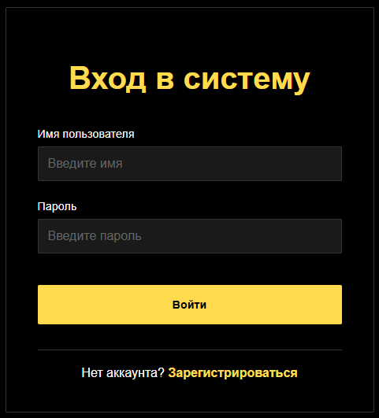
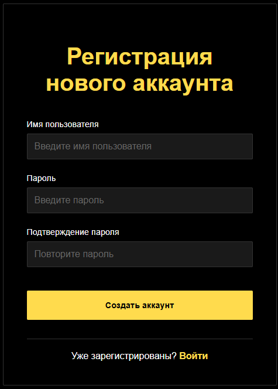
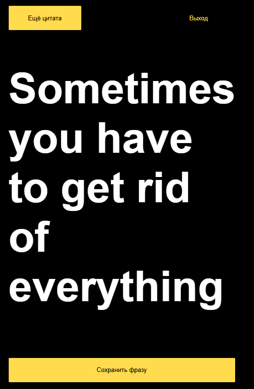
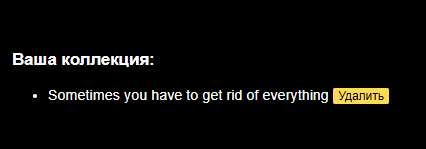

# Kanye quotes
Kanye quotes is a website, where you can generate random quotes of your favourite singer and save it in your personal list.

	         	  

[](https://github.com/KochetkovAlEX/kanye_quotes/actions/workflows/ci.yml) [](https://github.com/KochetkovAlEX/kanye_quotes/actions/workflows/dependabot/dependabot-updates)
## Installation
1. **Clone the repository**
   ```shell
   git clone https://github.com/KochetkovAlEX/kanye_quotes.git
   ```

2. **Navigate to the project directory**
   ```shell
   cd kanye_quotes
   ```

3. **Install dependencies**
   ```shell
   bundle install
   ```

4. **Set up the database**
   Create the database and run migrations to build the schema:
   ```shell
   bin/rails db:create
   bin/rails db:migrate
   ```
   
5. **Tests**
   Run tests:
   ```shell
   bin/rails db:test:prepare
   bin/rails test
   ```

6. **Start the application**
   Launch the Rails built-in server:
   ```shell
   bin/rails server
   ```

## Preview

<p align="center">
  
</p>

<p align="center">
  <b>Login page</b>
</p>

-----

<p align="center">
  
</p>

<p align="center">
  <b>Registration page</b>
</p>

-----
<p align="center">
  
</p>

<p align="center">
  <b>Main page</b>
</p>

----
<p align="center">
  
</p>

<p align="center">
  <b>Quote list</b>
</p>
